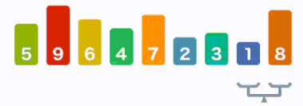

= Property Based Testing : la vérité vraie !
:icons: font
:asset-uri-scheme: https
:source-highlighter: highlightjs
:deckjs_theme: swiss
:deckjs_transition: fade
:navigation: false
:goto: true
:status: true
:conf: bdxio

image::images/{conf}.jpg[float="right"]

== Me

icon:twitter[] @binout +
icon:github[] https://github.com/binout

image::images/lectra-versalis.jpg[versalis, 800]

== Tests Pyramid

.https://martinfowler.com/bliki/TestPyramid.html
image::images/test-pyramid.png[]

== Test Driven Development

.https://www.supinfo.com/articles/single/3034-test-driven-development
image::images/TDD.png[]

== Write a test that fails

* A partir de la spécification
* En trouvant des cas d'utilisation (exemples)
* Les cas au limite
* Mais c'est pas toujours facile ...

== Property Based Testing

[quote]
Property-based tests make statements about the output of your code based on the input, and these statements are verified for many different possible inputs.

== Domain Driven Design

Recherche d'invariant dans le domaine métier

Permet d'explorer le domaine métier

== There and Back Again

[quote]
Serialize + De-serialize = same

image::images/serialize.png[]

== Some things never change

[quote]
List.sort = same size, same content

== Hard to compute, easy to verify

[quote]
Find itinerary

== Tools

* Intégration avec un runner de test
* Besoin de générer des données aléatoires
* Réduction des valeurs possibles en entrée
* Permet de créer ses propres générateurs

== Libraries

* Haskell : Quickcheck
* Scala : ScalaTest
* Kotlin : kotlintest
* Java : 
** Junit-quickcheck pour Junit 4
** jqwik pour Junit 5

== Demo : jqwik

== Des vérités

Propriété vérifiée avec un outil doit être plus simple que le code testé

Mockito.any() => PBT

PBT, comme une assurance

TDD vs PBT , non !

TDD AND PBT FTW !

== Pour aller plus loin

video::O-LWbSUaEQU[youtube]
