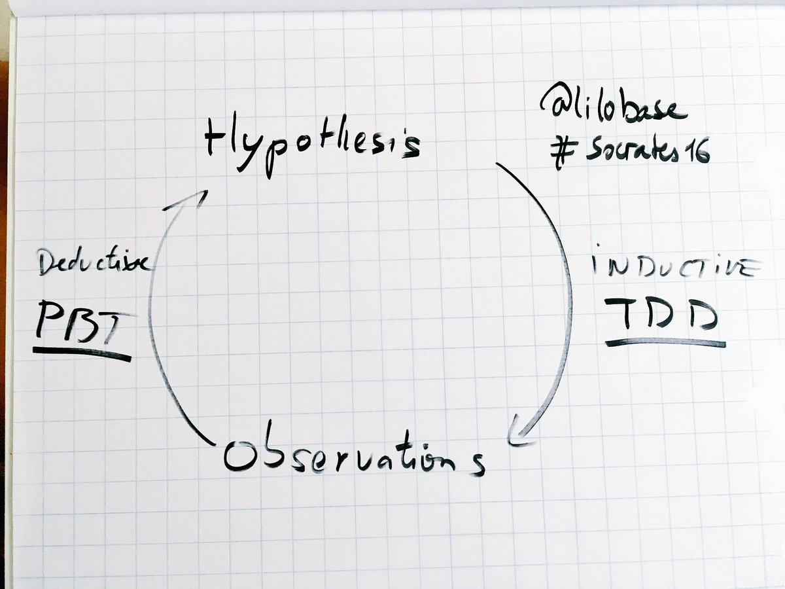

= Property Based Testing : la vérité vraie !
:icons: font
:asset-uri-scheme: https
:source-highlighter: highlightjs
:deckjs_theme: swiss
:deckjs_transition: fade
:navigation: false
:goto: true
:status: true
:conf: bdxio

image::images/{conf}.jpg[float="right"]

== Benoit Prioux

icon:twitter[] @binout +
icon:github[] https://github.com/binout

image::images/lectra.png[]

image::images/lectra-versalis.jpg[versalis, 800]

== Pyramide des tests

.https://martinfowler.com/bliki/TestPyramid.html
image::images/test-pyramid.png[]

== Développement piloté par les tests

.https://www.supinfo.com/articles/single/3034-test-driven-development
image::images/TDD.png[]

== Inductif vs Deductif

.https://twitter.com/lilobase/status/769921361141784576

== Tests par propriétés

[quote]
Exprimer des propriétés et laisser une suite de tests les vérifier pour un grand nombre d'entrée.

== Propriété 

.Ensemble des entiers naturels
[quote]
∀a ∈ ℕ a ≥ 0

.Concaténation de string
[quote]
(a + b).length = a.length + b.length

[canvas-image=images/property-finding.png]
== Propery finding

[.canvas-caption, position=top-left]
Comment trouver des propriétés ?

== Règles métiers

[quote]
Trouver les invariants dans votre domaine métier 

image::images/business-rules.png[]

== Aller-Retour

[quote]
Serialiser + Déserialiser = idem

image::images/serialize.png[]

== Certaines choses ne changent jamais

[quote]
List.sort( ) = même taille, mêmes éléments

== Difficile à calculer, facile à vérifier

[quote]
Trouver un chemin

image::images/itinerary.png[]

== Outils

image::images/data.png[float=right]

* Intégration avec un runner de test
* Besoin de générer des données aléatoires
* Permet de créer ses propres générateurs
* Réduction des valeurs possibles en entrée

== Librairies

image::images/haskell.png[float=right]

* Haskell : `Quickcheck`
* Scala : `ScalaCheck`
* Kotlin : `KotlinTest`
* Java : 
** `JUnit-Quickcheck` pour Junit 4
** `Jqwik` pour Junit 5

== Démo : jqwik

image::images/molkky.png[]

== A vous de tester !

[quote]
Propriété vérifiée avec un outil doit être plus simple que le code testé

* Pour aller plus loin :
** Université Devoxx 2016 (Cyrille Martraire - Romeu MOURA)

video::O-LWbSUaEQU[youtube]
